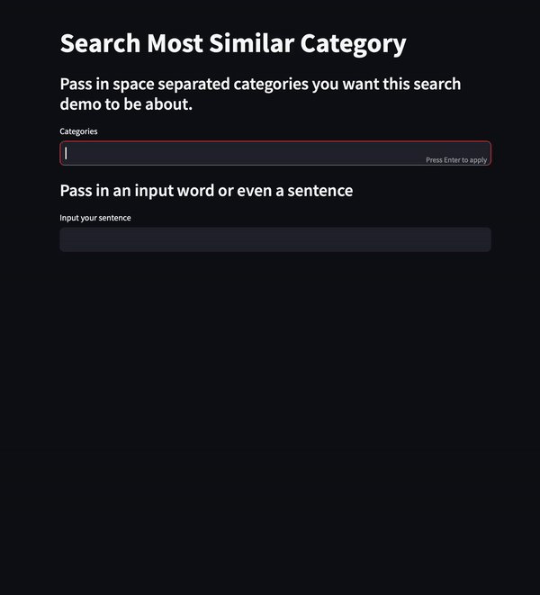

# READ ME



## Abstract
This application is a search-based retrieval demo that uses GloVe (Global Vectors for Word Representation) and Sentence Transformers to find the closest words to a given input.

The user can select a model type and input categories and a sentence. The application then checks if the GloVe embeddings exist for the selected model type. If not, it downloads them.

The application then loads the GloVe embeddings and calculates the cosine similarity for the input sentence using both GloVe and Sentence Transformers.

The results are displayed to the user, showing the closest words to the input sentence according to the categories provided. The results are also visualized in a chart.

The GloVe model used in this application is pretrained on 2 billion tweets with a vocabulary size of 1.2 million.

## Installation
 For this demo you need to the GloVe: Global Vectors for Word Representation embeddings.
 
 You can download them here: [GloVe](https://nlp.stanford.edu/projects/glove/)

To install all the dependencies using a requirements.txt file, follow these steps:

```pip install -r requirements.txt```

Alternatively, you can use a Conda environment with all the dependencies. Here's how:

Create a new Conda environment (replace myenv with the name you want to give to your environment):

```conda create --name myenv```

Activate the new environment:

```conda activate myenv```

Navigate to the directory containing your requirements.txt file (replace /path/to/your/directory with the actual path to your directory):

```cd /path/to/your/directory```

Install the dependencies using the requirements.txt file:

```cd /path/to/your/directory```

## Running the Application
To run this application in Streamlit, follow these steps:

Navigate to the directory containing your app.py file in the terminal:

```cd /path/to/your/directory```

Run the Streamlit application:

```streamlit run app.py```

Streamlit will provide a local URL in the terminal (usually http://localhost:8501) where you can view the running application. Open this URL in a web browser to interact with the application.

## Sample

Link to [HuggingFace Space Streamlit App](https://huggingface.co/spaces/sgabriel92/EEP596_LLM_Category_Search)
